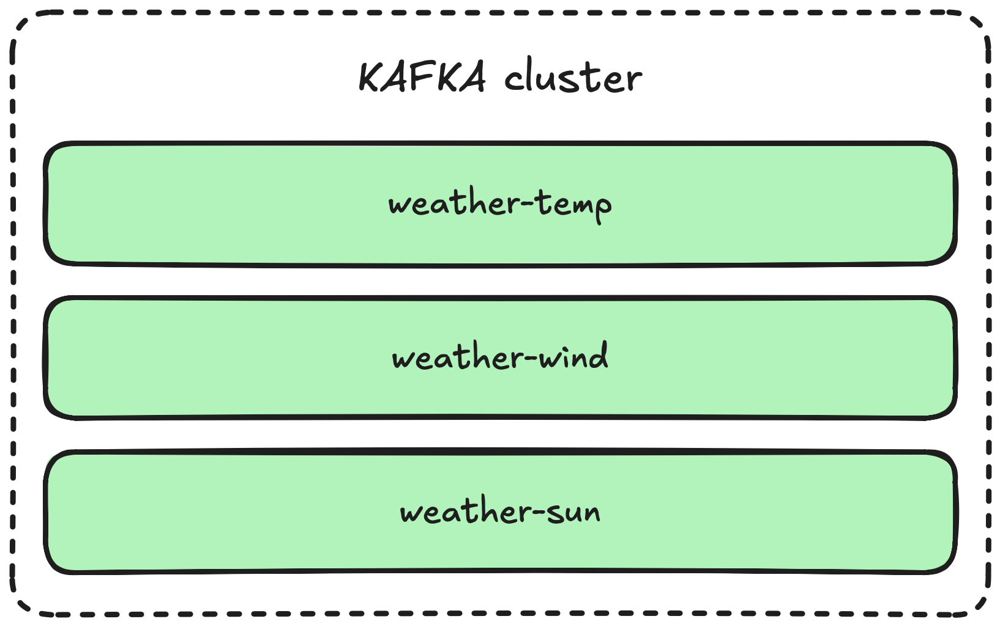
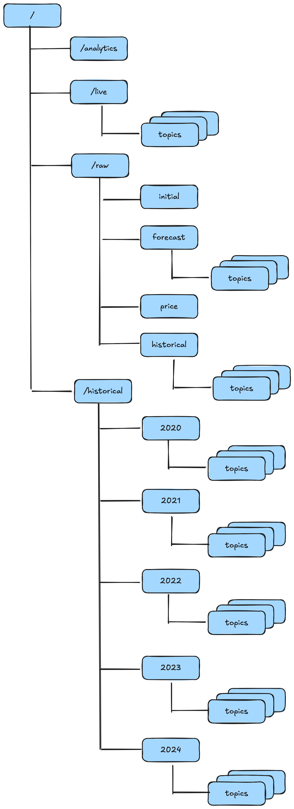
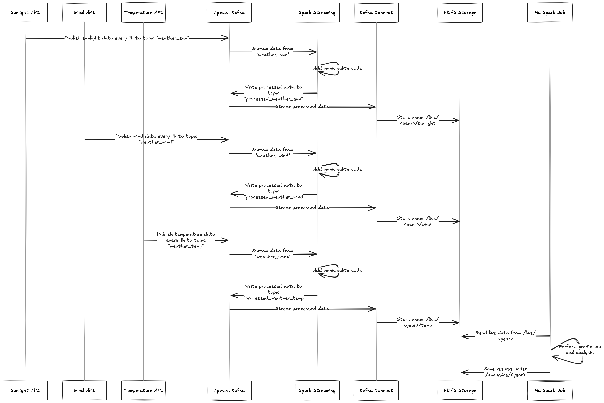

# Big Data Project Overview 

## Scope
- Costumers: open source platform, can be valuable for example to EnergiNet and private businesses which provides energy.

- Goals:
    1) predict the energy shortage for the following week (production we use live data weather & historical consumption) 
    2) identify areas with limited energy and then alert subscribers bases on shortage prediction
    3) (optional) predict price for next week based on historical data and calculate it with live data (live data weather, historical price & predicted consumption )

## Data lifecycle
- **Initial load**:
Initial ---> Hive ---> `/raw/initial` ---> Spark (enrichment-process) ---> `/historical/year/topic*`
- **Live data**:
Live forecast ---> Kafka ---> Spark Streaming ---> Kafka enriched ---> `/raw/forecast` ---> Spark (forecast-process) ---> `/live/topic*`
Live price ---> Kafka ---> Spark Streaming ---> Kafka enriched ---> `/raw/price` ---> Spark (price-process) ---> `/live/topic*`
- **Historical data**:
Historical consumption/weather ---> Hive --> `/raw/historical/topic*` ---> Spark (enrichment-process) --> `/historical/year/topic*`

## How do we manage live data?

We use the `/live` directory to store only the latest predictions. These files are not removed immediately, we keep them available for the prediction dashboard and to preserve the data used in the most recent prediction process.
After some time, the live data in `/raw` can be safely deleted. We don’t move this data to the historical folder because it represents real-time predictions, not past or finalized records.

## Energy production prediction

For energy production prediction, we calculate the mean value of wind speed cubed and solar irradiance for each `KOMMUNE`. Then, we determine the number of turbines near that municipality and use it to estimate the expected energy production. We will use this [website](https://turbines.dk/statistics/) to get the number of turbines per municipality.

## KAFKA Topics Diagram

## HDFS Structure Diagram

## Live Data Flow Diagram
