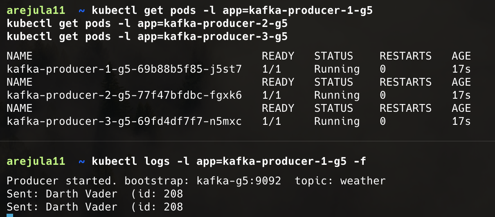

# APIs consumers guide

In this step by step guide we will explain how we created the API consumers that will fetch data from the API and send it to Kafka. Also we will see how we can check that kafka is receiving the data correctly and is possible to consume from the topics. To do it we will use the [Superhero API](https://superheroapi.com/) as an example. 

## Prerequisites
- Docker
- Kubernetes
- Kafka
- Python 3.11
- Python libraries: requests, kafka-python
- An account in [Docker Hub](https://hub.docker.com/) to upload the docker image

## Step 1: Create the API consumer
The first step is to create the API consumer that will fetch data from the API and send it to Kafka. We will use Python for this task. The code can be found in the file [producer-kafka.py](/kubernetes/producers/producer-kafka.py).

In this code we first import the necessary libraries and set the configuration variables. Which are:
- `API_URL`: The URL of the API we want to fetch data from.
- `TOPIC`: The Kafka topic where we want to send the data.
- `BOOTSTRAP`: The Kafka bootstrap servers.
- `POLL_SECONDS`: The number of seconds to wait between each API call.

Then we create a Kafka producer using the `KafkaProducer` class from the `kafka-python` library. We set the `bootstrap_servers` parameter to the value of the `BOOTSTRAP` variable and the `value_serializer` parameter to a lambda function that converts the data to JSON format and encodes it to UTF-8.

Next, we define a function `fetch_data` that takes a URL as a parameter and fetches data from the API using the `requests` library. If the request is successful, it returns the JSON data. If there is an error, it prints the error message and returns `None`.

Finally, we enter an infinite loop where we fetch data from the API using the `fetch_data` function. If the data is not `None`, we send it to Kafka using the `send` method of the producer. We also print a message indicating that the data has been sent. If there is an error sending the data to Kafka, we print the error message. We then wait for the number of seconds specified in the `POLL_SECONDS` variable before fetching data again.

## Step 2: Create the Docker image
The next step is to create a Docker image for the API consumer. We will use the [Dockerfile](/kubernetes/producers/Dockerfile) located in the `kubernetes/producers` directory. This Dockerfile uses the official Python 3.11 image as the base image. It sets the working directory to `/app`, copies the `requirements.txt` file to the container, and installs the required Python libraries using `pip`. Then it copies the `producer-kafka.py` file to the container, sets the `PYTHONUNBUFFERED` environment variable to `1` to ensure that the output is not buffered, and finally sets the command to run the `producer-kafka.py` script.

To build the Docker image, navigate to the `kubernetes/producers` directory and run the following command:

```bash
docker build -t arejula11/kafka-producer:latest .
```
Replace `arejula11` with your Docker Hub username.
Once the image is built, you can push it to Docker Hub using the following command:

```bash
docker push arejula11/kafka-producer:latest
```
In the example appears as `arejula11/kafka-producer:latest`. But if you want to use it, you have to replace `arejula11` with your own Docker Hub username.

## Step 3: Deploy the API consumer to Kubernetes

The final step is to deploy three API consumers to Kubernetes. In this setup, each API consumer configuration is defined using a **ConfigMap**, and each ConfigMap is attached to a separate **Deployment**. This allows you to run multiple API consumers fetching data from different APIs and sending it to different Kafka topics.

We will use the [kafka-producers.yaml](/kubernetes/producers/kafka-producers.yaml) file. This file now contains three ConfigMaps and three corresponding Deployments:

* **ConfigMaps** define environment variables for each API consumer:

  * `API_URL`: the URL to fetch data from.
  * `TOPIC`: the Kafka topic to publish data to.
  * `BOOTSTRAP_SERVERS`: the Kafka server address.
  * `POLL_INTERVAL`: how often to fetch data (in seconds).

* **Deployments** define:

  * The number of replicas (default is 1 per deployment).
  * The container image to use (`arejula11/kafka-producer:latest`—replace `arejula11` with your Docker Hub username).
  * The environment variables to load from the corresponding ConfigMap.


You can add additional API consumers by creating new ConfigMaps and Deployments following this pattern.

### Deploy to Kubernetes

1. Navigate to the `kubernetes/producers` directory:

```bash
cd kubernetes/producers
```

2. Apply the Kubernetes manifests:

```bash
kubectl apply -f kafka-producers.yaml
```

This will create all three ConfigMaps and Deployments, starting the API consumer pods.

### Verify the deployment

Check the status of the pods:

```bash
kubectl get pods -l app=kafka-producer-1-g5
kubectl get pods -l app=kafka-producer-2-g5
kubectl get pods -l app=kafka-producer-3-g5
```

View logs to verify that data is being fetched and sent to Kafka:

```bash
kubectl logs -l app=kafka-producer-1-g5 -f
```

You should see logs indicating that the API consumers are successfully retrieving data from the APIs and sending it to the corresponding Kafka topics:


This indicates that the API consumer is successfully fetching data from the API and sending it to Kafka.

## Step 4: Verify data in Kafka
To verify that the data is being sent to Kafka correctly, you can use the Kafka console consumer. First, you need to get access to the Kafka pod. The easiest way is to use the VSCode Kubernetes extension to open a terminal in the Kafka pod. However, if you don't have that set up, you can also use `kubectl exec` to get a shell in the Kafka pod.

```bash
kubectl exec -it kafka-g5-controller-0 -- bash
```

Once you have access to the Kafka pod, you can run the following command to list all the topics in Kafka:

```bash
kafka-topics.sh --bootstrap-server kafka-g5:9092 --list
``` 
You should see the list of topics:
```bash
__consumer_offsets
consumption
price
weather
```
Now, you can use the Kafka console consumer to consume messages from the `weather` topic. Run the following command:

```bash
kafka-console-consumer.sh --bootstrap-server kafka-g5:9092 --topic weather --from-beginning
```
You should see the messages being printed in the console as they are sent by the API consumer. This indicates that the data is being sent to Kafka correctly and is available for consumption. Furthermore, every each ten seconds you should see a new message being printed, as the API consumer is fetching data from the API. The messages should look like this:

## Conclusion
In this guide we have seen how to create an API consumer that fetches data from an API and sends it to Kafka. We have also seen how to create a Docker image for the API consumer and deploy it to Kubernetes. Finally, we have verified that the data is being sent to Kafka correctly by consuming messages from the Kafka topic. You can now use this setup to fetch data from any API and send it to Kafka for further processing.

