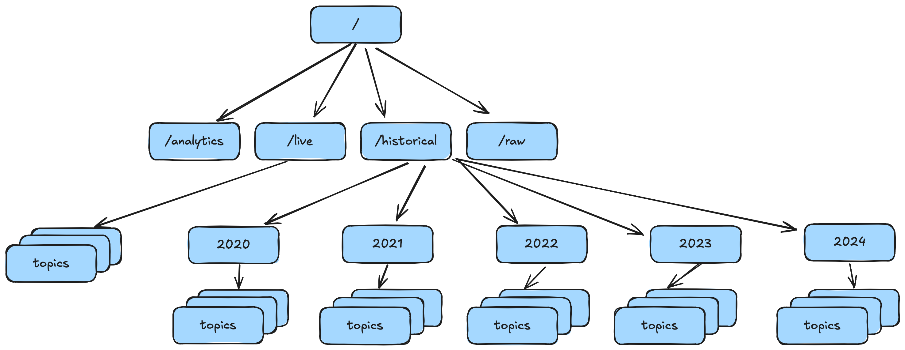

# Creating Directory Structure in HDFS

This guide explains how to create the base folder structure in HDFS and how to connect to the HDFS cluster to execute commands for creating directories.

## Prerequisites

Before you begin, make sure:

- Your HDFS cluster is up and running.
- The following pods are in `Running` state:

```bash
kubectl get pods
```

Example output:

```
NAME               READY   STATUS    AGE
namenode-g5-0      1/1     Running   33d
datanode-g5-0      1/1     Running   33d
datanode-g5-1      1/1     Running   33d
datanode-g5-2      1/1     Running   33d
datanode-g5-3      1/1     Running   33d
```


## Step 1. Access the NameNode Pod

To create directories in HDFS, you need to access the NameNode pod. In my case I decided to use the VSCode Kubernetes extension to open a terminal in the NameNode pod. Alternatively, you can use the following command to access the NameNode pod directly from your terminal:

```bash
kubectl exec -it namenode-g5-0 -- bash
```

You should now see a shell prompt like:

```
root@namenode-g5-0:/#
```


## Step 2. Create the HDFS Directory Structure

Use the `hdfs dfs -mkdir` command to create the top-level folders:

```bash
hdfs dfs -mkdir /raw /historical /live /analytics
```

This command creates the following directories in HDFS:

```
/raw
/historical
/live
/analytics
```


## Step 3. Verify the Created Directories

List the root directory in HDFS to confirm creation:

```bash
hdfs dfs -ls /
```

Expected output:

```
Found 4 items
drwxr-xr-x   - root supergroup          0 /analytics
drwxr-xr-x   - root supergroup          0 /historical
drwxr-xr-x   - root supergroup          0 /live
drwxr-xr-x   - root supergroup          0 /raw
```


## Step 4. Creating Yearly and Topic Subdirectories in `/historical`

To organize historical data by **year** and **topic**, create a nested folder structure under `/historical` directly from the NameNode pod.

### Create the Folder Structure

Run the following script **directly in the terminal** to create one folder per year (2020–2024) and one subfolder per topic (`weather-wind`, `weather-temp`, `weather-sun`) inside each year:

```bash
for year in {2020..2024}; do
  for topic in weather-wind weather-temp weather-sun; do
    hdfs dfs -mkdir -p /historical/$year/$topic
  done
done
```

This command will create a structure similar to:

```
/historical/2020/weather-wind
/historical/2020/weather-temp
/historical/2020/weather-sun
...
/historical/2024/weather-wind
/historical/2024/weather-temp
/historical/2024/weather-sun
```

### Verify the Result

List the contents of the `/historical` directory to confirm creation:

```bash
hdfs dfs -ls /historical
```

Expected output:

```
Found 5 items
drwxr-xr-x   - root supergroup          0 /historical/2020
drwxr-xr-x   - root supergroup          0 /historical/2021
drwxr-xr-x   - root supergroup          0 /historical/2022
drwxr-xr-x   - root supergroup          0 /historical/2023
drwxr-xr-x   - root supergroup          0 /historical/2024
```

To confirm the topic folders inside a year:

```bash
hdfs dfs -ls /historical/2022
```

Expected output:

```
Found 3 items
drwxr-xr-x   - root supergroup          0 /historical/2022/weather-sun
drwxr-xr-x   - root supergroup          0 /historical/2022/weather-temp
drwxr-xr-x   - root supergroup          0 /historical/2022/weather-wind
```

Inside each topic folder, there will be 12 `avro` files representing monthly data. The name of each file will specify the month of the data it contains.

## Step 5. Creating Topic Subdirectories in `/live`
Similarly, create topic subdirectories under the `/live` directory for real-time data:

```bash
hdfs dfs -mkdir /live/weather-temp
hdfs dfs -mkdir /live/weather-wind
hdfs dfs -mkdir /live/weather-sun 
```

To verify:

```bash
hdfs dfs -ls /live
```
Expected output:

```
Found 3 items
drwxr-xr-x   - root supergroup          0 2025-11-05 13:01 /live/weather-sun
drwxr-xr-x   - root supergroup          0 2025-11-05 13:01 /live/weather-temp
drwxr-xr-x   - root supergroup          0 2025-11-05 13:01 /live/weather-wind
```

## Final Structure Overview

| Directory     | Purpose                                                                                   |
| ------------- | ----------------------------------------------------------------------------------------- |
| `/raw`        | Stores raw ingested data (unprocessed weather, energy, or sensor files)                   |
| `/historical` | Stores historical weather data organized by year and topic (`/historical/YYYY/weather-*`) |
| `/live`       | Contains real-time streaming weather data by topic (temperature, wind speed, solar energy)         |
| `/analytics`  | Stores processed and aggregated data used for analytics, dashboards, or reporting         |


## Example Folder Tree

### Folder Tree
```text
hdfs://namenode-g5:9000/
│
│
├── historical/                          (~11 GB - enriched data)
│   ├── 2020/
│   │   ├── weather-wind/
│   │   │   ├── 01.avro/                 (historical observations - batch job)
│   │   │   │   ├── part-00000-*.avro
│   │   │   │   └── part-00001-*.avro
│   │   │   ├── 02.avro/
│   │   │   └── ... (12 months)
│   │   ├── weather-temp/
│   │   └── weather-sun/
│   │
│   ├── 2021/
│   │   ├── weather-wind/
│   │   ├── weather-temp/
│   │   └── weather-sun/
│   │
│   ├── 2022/
│   │   ├── consumption/                   (5 months: 08-12)
│   │   │   ├── 08.avro/
│   │   │   │   ├── part-00000-*.avro
│   │   │   │   └── part-00001-*.avro
│   │   │   ├── 09.avro/
│   │   │   ├── 10.avro/
│   │   │   ├── 11.avro/
│   │   │   └── 12.avro/
│   │   ├── weather-wind/                  (12 months: 01-12)
│   │   │   ├── 01.avro/
│   │   │   ├── 02.avro/
│   │   │   ├── ...
│   │   │   └── 12.avro/
│   │   ├── weather-temp/                  (12 months)
│   │   └── weather-sun/                   (12 months)
│   │
│   ├── 2023/
│   │   ├── consumption/                   (12 months: 01-12)
│   │   ├── weather-wind/                  (12 months)
│   │   ├── weather-temp/                  (12 months)
│   │   └── weather-sun/                   (12 months)
│   │
│   ├── 2024/
│   │   ├── consumption/                   (12 months: 01-12)
│   │   ├── weather-wind/                  (12 months)
│   │   ├── weather-temp/                  (12 months)
│   │   └── weather-sun/                   (12 months)
│   │
│   ├── 2025/
│   │   ├── consumption/                   (11 months: 01-11 - batch processed)
│   │   │   ├── 01.avro/
│   │   │   ├── 02.avro/
│   │   │   ├── ...
│   │   │   └── 11.avro/
│   │   │
│   │   ├── weather-wind/                  (historical observations - batch job)
│   │   │   └── 01.avro/
│   │   │       ├── part-00000-*.avro
│   │   │       └── part-00001-*.avro
│   │   │
│   │   ├── forecast-wind/                 (NEW: live forecast batches - streaming)
│   │   │   └── 12/                        (December 2025)
│   │   │       ├── 05-16-29_batch-0_9691250b/     (Day 5, 16:29, batch 0, UUID)
│   │   │       │   └── part-00000-*.avro
│   │   │       ├── 05-16-30_batch-1_9691250b/     (Day 5, 16:30, batch 1)
│   │   │       │   └── part-00000-*.avro
│   │   │       ├── 05-16-31_batch-2_9691250b/
│   │   │       │   └── part-00000-*.avro
│   │   │       ├── ...
│   │   │       ├── 05-17-23_batch-32_9691250b/    (Last batch of cycle)
│   │   │       │   └── part-00000-*.avro
│   │   │       ├── 05-17-24_batch-33_42abcd32/    (New forecast cycle!)
│   │   │       │   └── part-00000-*.avro
│   │   │       ├── 05-17-25_batch-34_42abcd32/
│   │   │       │   └── part-00000-*.avro
│   │   │       ├── ...
│   │   │       ├── 06-00-20_batch-65_42abcd32/    (Day 6, new day!)
│   │   │       │   └── part-00000-*.avro
│   │   │       └── 06-00-21_batch-0_97906687/     (New forecast cycle!)
│   │   │           └── part-00000-*.avro
│   │   │
│   │   ├── weather-temp/
│   │   │   └── 01.avro/
│   │   │
│   │   ├── forecast-temp/                 (NEW: live forecast batches - streaming)
│   │   │   └── 12/
│   │   │       ├── 05-16-29_batch-0_9691250b/
│   │   │       │   └── part-00000-*.avro
│   │   │       ├── 05-16-30_batch-1_9691250b/
│   │   │       │   └── part-00000-*.avro
│   │   │       └── ...
│   │   │
│   │   ├── weather-sun/
│   │   │   └── 01.avro/
│   │   │
│   │   └── forecast-sun/                  (NEW: live forecast batches - streaming)
│   │       └── 12/
│   │           ├── 05-16-29_batch-0_9691250b/
│   │           │   └── part-00000-*.avro
│   │           ├── 05-16-30_batch-1_9691250b/
│   │           │   └── part-00000-*.avro
│   │           └── ...
│   │
│   └── archives/                               
│       └── 2025/
│           └── 12/
│               ├── live/
│               │   ├── forecast-wind/          
│               │   │   ├── 05-17-24-a94e5561/  # UUID cycles
│               │   │   ├── 05-20-52-42abcd32/
│               │   │   └── 06-00-21-97906687/
│               │   │
│               │   ├── forecast-temp/
│               │   │   ├── 05-17-24-a94e5561/
│               │   │   ├── 05-20-52-42abcd32/
│               │   │   └── 06-00-21-97906687/
│               │   │
│               │   └── forecast-sun/
│               │       ├── 05-17-24-a94e5561/
│               │       ├── 05-20-52-42abcd32/
│               │       └── 06-00-21-97906687/
│               │
│               └── analytics 
│
│
├── live/                                  (273 MB - current forecast cycle accumulation)
│   └── forecast/
│       ├── weather-wind/                  (accumulates batches until new cycle)
│       │   ├── part-00000-00e2ce5c-...-c000.avro  (3.2 MB - batch 0)
│       │   ├── part-00000-0194ee2d-...-c000.avro  (3.2 MB - batch 1)
│       │   ├── part-00000-027cff7b-...-c000.avro  (3.2 MB - batch 2)
│       │   ├── ...
│       │   └── part-00000-f6e20d8b-...-c000.avro  (3.2 MB - batch 32)
│       │
│       ├── weather-temp/                  (accumulates batches until new cycle)
│       │   ├── part-00000-0013361b-...-c000.avro  (2.8 MB)
│       │   ├── part-00000-027cff7b-...-c000.avro  (2.8 MB)
│       │   ├── ...
│       │   ├── part-00000-919d4541-...-c000.avro  (21 KB - last batch)
│       │   └── part-00000-ff8f40ed-...-c000.avro  (2.8 MB)
│       │
│       └── weather-sun/                   (accumulates batches until new cycle)
│           ├── part-00000-02c60d20-...-c000.avro  (2.3 MB)
│           ├── part-00000-05bfd522-...-c000.avro  (2.3 MB)
│           ├── ...
│           ├── part-00000-59b4a515-...-c000.avro  (1.1 MB - last batch)
│           └── part-00000-c921a3b1-...-c000.avro  (2.3 MB)
│
├── raw/                                   (2.1 GB - CSV files)
│   └── initial-load/
│       ├── consumption/                   (38 files, 1.9 GB)
│       │   ├── consumption_2022_09.csv    (49.8 MB)
│       │   ├── consumption_2022_10.csv    (51.8 MB)
│       │   ├── ...
│       │   └── consumption_2025_11.csv    (30.6 MB)
│       │
│       ├── price/                         (10 files, 7.4 MB)
│       │   ├── DayAheadPrices_DK1_202101010000-202201010000.csv  (764 KB)
│       │   ├── DayAheadPrices_DK1_202201010000-202301010000.csv  (769 KB)
│       │   ├── ...
│       │   └── DayAheadPrices_DK2_202501010000-202601010000.csv  (544 KB)
│       │
│       ├── weather-wind/                  (5 files, 165 MB)
│       │   ├── 2020_dmi_wind.csv          (33.0 MB)
│       │   ├── 2021_dmi_wind.csv          (32.9 MB)
│       │   ├── 2022_dmi_wind.csv          (33.1 MB)
│       │   ├── 2023_dmi_wind.csv          (33.1 MB)
│       │   └── 2024_dmi_wind.csv          (33.3 MB)
│       │
│       ├── weather-temp/                  (5 files, 176 MB)
│       │   ├── 2020_dmi_temp.csv          (35.2 MB)
│       │   ├── 2021_dmi_temp.csv          (35.1 MB)
│       │   ├── 2022_dmi_temp.csv          (35.1 MB)
│       │   ├── 2023_dmi_temp.csv          (35.0 MB)
│       │   └── 2024_dmi_temp.csv          (35.3 MB)
│       │
│       └── weather-sun/                   (5 files, 81 MB)
│           ├── 2020_dmi_sun.csv           (16.3 MB)
│           ├── 2021_dmi_sun.csv           (16.2 MB)
│           ├── 2022_dmi_sun.csv           (16.2 MB)
│           ├── 2023_dmi_sun.csv           (16.2 MB)
│           └── 2024_dmi_sun.csv           (16.3 MB)
│
├── tmp/                                   (temporary files)
│
├── user/                                  (user home directories)
│
└── utils/                                 (utility scripts and reference data)
    └── municipality_codes_to_coordinates.csv  (98 municipalities, lat/lon mapping)
```
                                   



