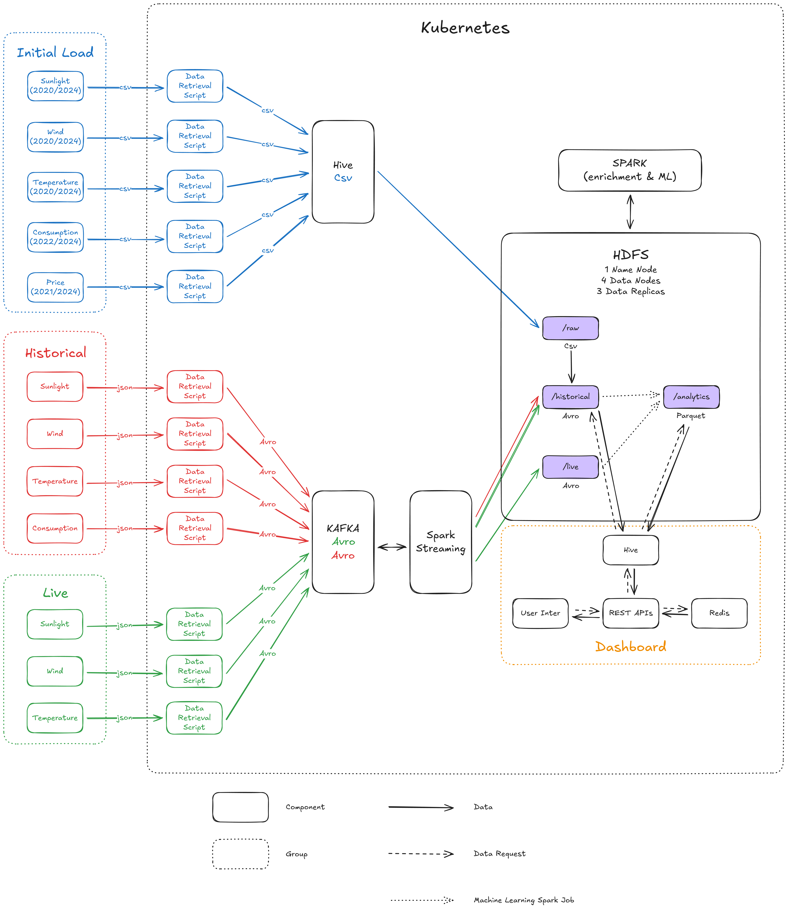

# Forecasting Renewable Energy Production, Electricity Consumption and Prices in Denmark

A comprehensive big data pipeline for hourly forecasting of renewable energy production (wind and solar), electricity consumption, and day-ahead electricity prices in Denmark.

## Project Overview

This system integrates live weather forecasts with historical data to deliver actionable predictions for Denmark's energy sector. The platform demonstrates a complete distributed analytics pipeline handling both batch and streaming workloads.

### Key Features

- **Renewable Energy Production Estimation**: Physics-informed capacity factor models for wind and solar production
- **Energy Consumption Prediction**: Machine learning models achieving 86-90% average precision
- **Day-Ahead Price Forecasting**: XGBoost-based models for DK1/DK2 bidding zones
- **Shortage Detection**: Real-time comparison of expected production vs. consumption

## Architecture

The system combines:
- **Data Ingestion**: Kafka with Avro serialization for streaming; Hive for bulk loading
- **Storage**: HDFS with structured /raw, /historical, /live, and /analytics zones
- **Processing**: Apache Spark (unified batch and streaming with Pandas UDFs)
- **Serving**: REST API with Redis caching and React dashboard
- **Orchestration**: Kubernetes deployment

### Data Sources

| Dataset | Provider | Time Range |
|---------|----------|------------|
| Weather (Wind, Solar, Temperature) | DMI | 2020-2024 |
| Consumption | Energi Data Service | 2022-2025 |
| Day-Ahead Prices | ENTSO-E | 2021-2025 |

## Technology Stack

- **Messaging**: Apache Kafka, Confluent Schema Registry
- **Storage**: HDFS, Avro, Parquet
- **Processing**: Apache Spark (PySpark with Structured Streaming)
- **Query Layer**: Apache Hive, Redis
- **ML**: XGBoost, scikit-learn, pandas
- **Infrastructure**: Kubernetes
- **Frontend**: React, NestJS

## Getting Started

Detailed setup instructions and deployment guides are available in the `/Guides` directory.

## Key Insights

### Consumption Prediction
- Average precision: 86-90%
- Features: Historical consumption, weather data, calendar effects
- Municipality-level modeling with global fallback

### Price Prediction
- Complex market dynamics require external data sources
- Weather and local production provide limited explanatory power
- High variability reflects Nord Pool market influences

## Architectural Highlights

- **Unified Processing**: Shared Spark codebase for batch and streaming
- **Reusable Enrichment**: Pandas UDFs for geographic metadata (municipality codes, DK zones)
- **Forecast Cycle Management**: Automatic archiving and live directory rotation
- **Deduplication Strategy**: Stateful stream processing for historical updates

## Performance

- Spark Structured Streaming: 6-second average aggregation latency
- Redis caching: Instant dashboard response for frequently accessed data
- Hourly prediction horizon with 6-hour forecast refresh cycles

## Lessons Learned

- Spark provides optimal balance for unified batch/streaming processing
- Physics-informed models ensure transparency for production estimates
- Price forecasting requires broader market context beyond local variables
- Unified tech stack reduces operational complexity

**Course**: Big Data, University of Southern Denmark  
**Date**: December 2025